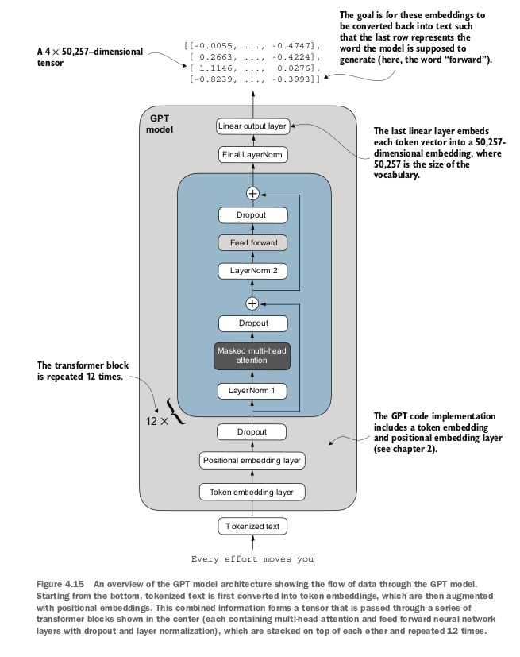

# An overview of how LLMs work (chp1):
Large Language Models (LLMs) work in three big steps:

### Training on massive text
- They’re fed huge amounts of text (books, code, websites).
- The model learns patterns: grammar, facts, reasoning shortcuts, styles of writing.
- The core task is predicting the next word in a sequence.

### Neural network architecture (Transformers)
- Built on the Transformer model.
- Uses self-attention to decide which words in a sentence matter most to each other.
- Multiple layers of attention and feedforward networks build complex representations of text.

### Inference (using the model)
- Given a prompt, the model encodes it into vectors.
- It predicts the most likely next token (word/part of word) repeatedly.

# Chapter 2

## 2.1 understanding word embeddings
Embeddings are just convertin non numerical data (such as text) into numeric data - this is called word embedding. map each word to a numeric data.
Also there's sentence or paragraph embeddings - mapping sentences/paras to numeric data (used in RAG btw)

word2vec is an embedding model that would figure out the word embeddings by predicting the context of that word given the target or by predicting the target given the context (exact details idk man)  
words that appear in similar contexts tend to have similar meaning  
Pretrained models are used to generate embeddings for ML models, llms however have their own embeddings in the input layer and are updated during training. Well why not just use word2vec?? here's the thing if you train your own embedding model then you have your data fitting into your context - it will match more with the context of you training data instead of something generic that word2vec will likely produce

Even the smallest gpt2 models with 117M and 125M parameters use an embedding size of 768 dimensions. GPT3 with 175b parameters uses 12,288 dimensions (sheesh)

Summary:
- Embeddings is the process of converting words/sentences(depends) into vectors
- word2vec is a pretrained neural network normally used to generate embeddings for ml models
- llms usually do not use word2vec. They have their own embeddings in the input layer. Think of llms as one neural network - everything is happening within

## 2.2 tokenizing text
now forget embeddings for a while, you need to tokenize text first.
- each word is a token, each special character is a token
- each whitespace is skipped, all others are split into tokens\

so you:
- downloaded the verdict, read it
- to understand tokenization, you write a regex that will split words on each whitespace (to get singular words)
- some words are connected with a punctuation so you're now splitting each punctuation mark too. 
- now loop through each and remove whitespace tokens for the simplicity 

## 2.3 converting tokens into token ids
In this step you will convert all tokens into token ids. This step comes before converting the token ids into embedding vectors. 
So far;
- split text into tokens
- convert into token ids 
- then comes 'embeddings'  
To convert into token ids; 
- just grab all words, create a set to remove duplicates
- use enumerate to assign a number to each and create a dict object - call it `vocab`
- now we'll use this `vocab` to convert all the tokens into token ids. You have a map, now you transform everything according to that map. 
  
  
  

At this point, you have a list of token_ids adjacent to each token so you can convert your original list of tokens into token_ids. 
Now well you need the opposite as well so you create a tokenizer class with an `encode` method that splits text into tokens and carries out the string-to-integer mapping to produce token IDs via the vocabulary and a `decode` method that carries out the reverse integer-to-string mapping to convert the token ids back into text. 
you create the `SimpleTokenizerV1` class for this:

```Python
class SimpleTokenizerV1:
    def __init__(self, vocab):
        self.str_to_int = vocab
        self.int_to_str = { i:s for s,i in vocab.items() }

    def encode(self,text):
        preprocessed = re.split(r'([,.?_!"()\']|--|\s)', text)
        preprocessed = [item.strip() for item in preprocessed if item.strip()]
        ids = [self.str_to_int[s] for s in preprocessed]
        return ids

    def decode(self, ids):
        text = " ".join([self.int_to_str[i] for i in ids])
        text = re.sub(r'\s+([,.?!"()\'])', r'\1', text)
        return text
    
```

Now try using a word which is not available in the vocab - (book used 'hello') and you'll get an error because the vocab does not know what you're saying - as that word wasn't in `the-verdict.txt`


## 2.4 Special context tokens
In 2.3, you encountered an error because the token which was to be encoded wasn't available in `vocab` so now enters `SimpleTokenizerV2` which will encode the words that aren't in `vocab` with a special token `<| unk |>`.

Also whenever concatenating text from different sources, use the `<| end of text |>` special token so that the model knows that these texts are separate - this will help in better 'next-word' prediction thingy as you will be separating the context.   
Now, you take your existing vocab and add two more tokens in it, `<| unk |>` and `<| end of text |>`. then create tokenizerv2 as following:  

```Python
class SimpleTokenizerV2:
    def __init__(self, vocab):
        self.str_to_int = vocab
        self.int_to_str = {i:s for s,i in vocab.items()}
    
    def encode(self, text):
        preprocessed = re.split(r'([,.:;?_!"()\']|--|\s)', text)
        preprocessed = [item.strip() for item in preprocessed if item.strip()]

        preprocessed = [item if item in self.str_to_int else "<|unk|>" for item in preprocessed]
        ids = [self.str_to_int[s] for s in preprocessed]
        return ids
    
    def decode(self, ids):
        text = " ".join([self.int_to_str[i] for i in ids])
        text = re.sub(r'\s+([,.:;?!"()\'])', r'\1', text)
        return text
```
tldr;  
- For words out of vocab, use the <| unk |> token, and <| EOS |> or <| end of text|> for end of a sentence (helps model understand context)
- gpt tokenizer only uses <| end of text |> token for simplicity
- gpt tokenizer also doesn't use <| unk |> token for out of vocab words instead they use byte pair encoding which breaks down words into subwords

## 2.5 Byte Pair Encoding
(book doesn't go deep  in this but i will, lol)  

BPE looks at data then decides how to tokenize them, went ahead and found out the whole algorithm, it's relatively easy

```
for k times:
    - choose the most frequentyly adjacent symbols (suppose t and h are appearing together a lot)
    - replace every adjacent t and h with th - like link them together
```
note that bpe does not need the `<| unk |>` token as it is iteratively figuring out words and assigning tokens unlike the tokenizing approaches of `SimpleTokenizerV2`. If it encounters an unfamiliar word during tokenization, it can represent it as a sequence of subword tokens or characters. 
The ability to break down unknown words into individual characters ensures that the tokenizer and, consequently, the LLM that is trained with it can process any text, even if it contains words that were not present in its training data  
(Normally used with `tiktoken` - library for tokenizing, duh?)

Just to recap, so far:  
- split text into tokens 
- use those tokens to create `vocab` i.e assign each token a token id
- convert all tokens into token ids
- created `SimpleTokenizerV1` (without special tokens), `SimpleTokenizerV2` (with special tokens) and then finally used `tiktoken` to just use BPE algorithm as BPE is much better at working with new words. if any word is not in its vocab, it will represent it as a collection of tokens


## 2.6 Data Sampling wih a sliding window
LLms are pretrained by predicting the next word in a text;  
  


Next step is to create input-target pairs.  
You accept a list of inputs then the model predicts the most likely next word for that list of inputs. 

Input is the group of words you feed into an llm  
target would be the word that it should predict  

##### Sliding window Approach: 
Read `the-verdict.txt`, and tokenize using bpe tokenizer
The most intuitive ways to create the input-target pairs for the next word prediction task is to create two variables, x and y, where x contains the input
tokens and y contains the targets, which are the inputs shifted by 1.
Take a chunk of tokens, create x from 0:lastidx and then a y from 1:lastidx+1

```Python
context_size = 4
x = enc_sample[:context_size]
y = enc_sample[1:context_size+1]
print(f"x: {x}")
print(f"y:
{y}")
```
Here, `context_size` is how many tokens would be included in the input. `context_size+ 1`would be the target pairs

#### Data Loader and Dataset classes
One last step before turning tokens into embeddings: implementing an efficient data loader that iterates over the input dataset and returns the inputs and targets as PyTorch tensors, which can be thought of as multidimensional arrays
  
  
  
Creating this class to create input/target pairs in tensors with each tensor created by a skipping-token-amount of `stride` (if that makes sense):  
Each row consists of a number of tokenIDs (based on `max_length`)

```Python
class GPTDatasetV1(Dataset):
    def __init__(self, txt, tokenizer, max_length, stride):
        self.input_ids = []
        self.target_ids = []

        token_ids = tokenizer.encode(txt)

        for i in range(0, len(token_ids) - max_length, stride):
            input_chunk = token_ids[i:1 + max_length]
            target_chunk = token_ids[i + 1: i + max_length + 1]
            self.input_ids.append(torch.tensor(input_chunk))
            self.target_ids.append(torch.tensor(target_chunk))

    
    def __len__(self):
        return len(self.input_ids)
    
    def __getitem__(self, idx):
        return self.input_ids[idx], self.target_ids[idx]

```

The code here was kinda complicating so just to recap:  
- you're creating batches of input and target ids - call them `chunks`
- Think of each `chunk` as a tensor in figure 2.13. target chunk is 1 item shifted of input chunk
- `stride` is how many tokens you will skip through in the next iteration
- the other two methods are self-explanatory

After that, you just create a small function which works as an invoker/instantiator to the gptdatasetv1 class

```
def create_dataloader_v1(txt, batch_size=4, max_length=256, stride=128, shuffle=True, drop_last=True, num_workers=0):
    tokenizer = tiktoken.get_encoding("gpt2")
    dataset = GPTDatasetV1(txt, tokenizer, max_length, stride)

    dataloader = DataLoader(
        dataset,
        batch_size=batch_size,
        shuffle=shuffle,
        drop_last=drop_last,
        num_workers=num_workers
    )

    return dataloader
```

Now, if you need to use the `GPTDatasetV1` class, you will do so with the `create_dataloader_v1` method. `GPTDatasetV1` will create the dataset and `DataLoader` will be also instantiated by the `create_dataloader_v1` class.

**Dataset Class** : represents data - tells pytorch what the data is and how to access individual samples
  
**DataLoader**: provides a way to load batches of data with shuffling and parallel processing

`max_length` will tell you what the maximum number of items should be in each tensor(both input and output). 
Also note `batch-size=1` results in tensor of length 1 (like 2d array, length1, inside the length1 you have `max_length` number of elements). 
Having a `batch_size=8` will result in a tensor of length 8

Smaller batch sizes = Noisy model updates, which is why its normal to have batch sizes over atleast 256.  
However,  
Smaller batch sizes = less memory required during training, so batch size is a tradeoff to experiment wd

Also note, batch_size is the length of a tensor and max_length is the number of items in each inner list (coz multidimensioanl array, remember) 


### 2.7 Create token embeddings
This is the last step.
Embeddings are continuous vector representations and they're necessary since gpt-like llms are deep neural networks trained with the backpropagation algorithm.
(idk how neural networks are trained with backpropagation algorithm and i dont have time right now so i'll use all my knowledge from reading that one AI history book and random geoffrey hinton articles i found on medium which is that you get to the output, then backtrace. Like go back, and adjusst the weights of that node which was activated to get to that output and if im not wrong you do this for each hidden layer)  

To understand how token id to embedding vector conversion works, take four token ids, small vocab (6 words) and u want to create an embedding size of 3 (note that embedding size is dimensions and its normal to have a lott of those, gpt 3 has 12, 288 - jeez)


- embeddings are vector representation of tokens. 
- In training, you have tokens, you assign a random embedding to all of them then you try predicting the next word in a sentence - this would mostly be wrong so you go back (back propagation) to figure where the error came from then you calculate loss and all to adjust embedding vector values plus some weights now your model is slightly better. repeat this a 1000 times until your model gets better. 
- `vocab_size` and `output_dim` is the dimension of the resulting tensor embedding thingy

- embedding layer is the first real layer of the llm neural network except it's not a layer in the traditional sense - it works as a map. it has a tensor that contains one row per token id and that row is the adjacent embedding. It will map the token id resulting in an output of a 'continuous vector representation' or most commonly known as its gangsta name `embedding`  

In other words, the embedding layer is essen-
tially a lookup operation that retrieves rows from the embedding layer’s weight matrix
via a token ID.

To recap, so far:
- you tokenize words  
- you map them to a vocab providing a token id for each
- you have to now map them into input-target pairs
- then you use batches and stuff to come up with tensors with bunch of parameters such as `max_length` (max token per row), `stride` (how many tokens to skip before moving on to the next per batch) using `Dataset` class (responsible for creating effective datasets with proper batching and input/target pairs) and a `DataLoader` class which will aid in fetching input/target tensors one by one
- then finally, you convert these input tensors into embedding layeer. You already know the outputs (input/target pairs, remember?) so you're gonna help the llm learn better which inputs are to be mapped to which outputs. Note that embeddings are assumed at first then gradually adjusted during the training process


### 2.8 Encoding word positions
The token id remains the same regardless of it's position and regardless of how far apart it is. Now you can think of a problem here, 
imagine two sentences "I dont think this is working" and "I like this", the position of "this" and "i" in both of the sentences has variable lengths but the words in both of these sentences will have the same token id. "this" in sentence 1 and sentence 2 will have the same token id even though they are used in different contexts and you can see how the model will have probs figuring out what words to pay attention to if they just have the same token ids.  

To solve this, there's two broad categories of position-aware embeddings (embeddings unlike the ones described above, they are aware of the "context" so to speak)  

- **Absolute Positional Embeddings**:  
. Absolute Positional Embeddings are directly associated with specific positions in a sequence. 


- **Relative Positional Embeddings**:  
Relative positional embeddings will tell you relationships based on how far apart instead of "at wihch exact position". this will help generalizing better to variable sequence length

(GPT models use absolute positional embeddings, instead of fixed positional encodings in the original transformer model)

To implement this, follow the following steps:  
- Load raw text from "the-verdict.txt"  
- Define vocabulary size and embedding dimension  
- Create an embedding layer to map token IDs to 256-dimensional vectors
- Tokenize text and prepare batches using create_dataloader_v1, with sliding windows
- Fetch one batch of input and target token IDs
- Convert token IDs to embeddings via the token embedding layer
- Create a positional embedding layer for max_length positions
- Generate absolute positional embeddings (one per position index)
- Add token and positional embeddings together to get final input  embeddings for 

## Chapter 2 Summary:
Summary
- LLMs require textual data to be converted into numerical vectors, known as
embeddings, since they can’t process raw text. Embeddings transform discrete
data (like words or images) into continuous vector spaces, making them com-
patible with neural network operations.
- As the first step, raw text is broken into tokens, which can be words or characters.
Then, the tokens are converted into integer representations, termed token IDs.
- Special tokens, such as <|unk|> and <|endoftext|>, can be added to enhance
the model’s understanding and handle various contexts, such as unknown
words or marking the boundary between unrelated texts.
the model
- The byte pair encoding (BPE) tokenizer used for LLMs like GPT-2 and GPT-3
can efficiently handle unknown words by breaking them down into subword
units or individual characters.
- We use a sliding window approach on tokenized data to generate input–target
pairs for LLM training.
- Embedding layers in PyTorch function as a lookup operation, retrieving vectors
corresponding to token IDs. The resulting embedding vectors provide continuous representations of tokens, which is crucial for training deep learning mod-
els like LLMs.
- While token embeddings provide consistent vector representations for each
token, they lack a sense of the token’s position in a sequence. To rectify this,
two main types of positional embeddings exist: absolute and relative. OpenAI’s
GPT models utilize absolute positional embeddings, which are added to the token
embedding vectors and are optimized during the model training.


# Chapter 3
So far, tokenize text, convert into token ids, create embeddings.
Now comes the attention mechanism part
4 variants of attention mechanism covered:
1) Simplified self attention
2) Self attention
3) Causal attention
4) Multi-head attention

### 3.1 The problem with modeling long sequences:
consider translating two languages, there are often occurrences where a sentence cannot be mapped word by word to another language as each language has its own semantics and certain words go at certain positions which isnt necessarily uniform among all languages. 
you can imagine, a translating neural network not being efficient if all its doing is translating each word without context.

To solve this problem, neural networks with encoder and decoders are used. The encoder reads the entire text and processes it and then the decoder produces the translated text. Before transformers, RNNs were used where outouts from previous steps are fed as inputs to the current step

The big limitation of encoder–decoder RNNs is that the RNN can’t directly access
earlier hidden states from the encoder during the decoding phase. Consequently, it
relies solely on the current hidden state, which encapsulates all relevant information.
This can lead to a loss of context, especially in complex sentences where dependen-
cies might span long distances.

### 3.2 Capturing data dependencies with attention mechanisms
RNNs wont work well for longer texts - but will work fine for shorter sentences. The problem is that RNN would not have a wider context of previous words in the input. The rnn must remember the entire encoeded in out iin a single hidden state before passing it to the decoder

To solve this, came bahdanau attention mechanism that had attention mechanism built in into it, but later everyone realized 'hey, we dont nned rnns' and enter transformer architecture with a self attention mechanism

### 3.3 Attending to different parts of the input with self attention:

## 3.3.1
The idea here is to create context vectors such that each element of a sequence (consider the phrase "Your Journey Starts") where each word is represented by x(i) and we have to calculate z(i) for all x(i) which is sort of a map for one word and its relation to all others if that makes sense

To illustrate this concept, let’s focus on the embedding vector of the second input
element, x(2) (which corresponds to the token “journey”), and the corresponding con-
text vector, z(2), shown at the bottom of figure 3.7. This enhanced context vector, z(2),
is an embedding that contains information about x(2) and all other input elements,
x(1) to x(T).

The first step of implementing self-attention is to compute intermediate values ω referred to as attention scores and for each input vector x(1), you compute relevant attention scores by finding out the dot product between the input vector x(1) and other input vector {x(2), x(3)}

In the next step, we normalize each of the attention scores we computed previously You have to obtain attention weights that must sum up to 1 - thus the normalization.

To normalize, divide each attention weight you calculated by the sum of all attention weights - doing so will result in a sum of all attention weights = 1

```Python
query = inputs[1]
attn_scores_2 = torch.empty(inputs.shape[0])
for i, x_i in enumerate(inputs):
    attn_scores_2[i] = torch.dot(x_i, query)
print(attn_scores_2)

attn_weights_2_tmp = attn_scores_2 / attn_scores_2.sum()
print("Attention weights:", attn_weights_2_tmp)
print("Sum:", attn_weights_2_tmp.sum())

```
Normalization can be done by using the softmax function, whose basic implementation is as follows:
```Python
def softmax_naive(x):
    return torch.exp(x) / torch.exp(x).sum(dim=0)

attn_weights_2_naive = softmax_naive(attn_scores_2)
print("Attention weights:", attn_weights_2_naive)
print("Sum:", attn_weights_2_naive.sum())

```

In addition, the softmax function ensures that the attention weights are always posi-
tive. This makes the output interpretable as probabilities or relative importance,
where higher weights indicate greater importance.

However the naive softmax algorithm may run into problems as overflow or underflow when dealing with large or small input values - which is why pytorch's softmax is much better

```Python
attn_weights_2 = torch.softmax(attn_scores_2, dim=0)
print("Attention weights:", attn_weights_2)
print("Sum:", attn_weights_2.sum())

```


Now since we have already calculated attention weights,we'll now calculate context vector - and you do that by multiplication of input tokens x(i) by their corresponding attention weights and then summing the resulting vectors.
Thus, context vector z(2) is the weighted sum of all input vectors, obtained by multiplying each input vector by its corresponding attention weight:

```Python
query = inputs[1]
context_vec_2 = torch.zeros(query.shape)
for i,x_i in enumerate(inputs):
    context_vec_2 += attn_weights_2[i]*x_i
print(context_vec_2)
```

Next, we will generalize this procedure for computing context vectors to calculate all context vectors simultaneously.

## 3.3.2 Computing Attention weights for all input tokens
#### Step 1
So far, we calculated attention weigths and context vector for input 2 so we're doing it for each input now
Modified code to compute all context vectors:

```Python

attn_scores = torch.empty(6, 6)
for i, x_i in enumerate(inputs):
    for j, x_j in enumerate(inputs):
        attn_scores[i, j] = torch.dot(x_i, x_j)
print(attn_scores)

```


The resulting attention scores look a lil like this:
```
tensor([[0.9995, 0.9544, 0.9422, 0.4753, 0.4576, 0.6310],
[0.9544, 1.4950, 1.4754, 0.8434, 0.7070, 1.0865],
[0.9422, 1.4754, 1.4570, 0.8296, 0.7154, 1.0605],
[0.4753, 0.8434, 0.8296, 0.4937, 0.3474, 0.6565],
[0.4576, 0.7070, 0.7154, 0.3474, 0.6654, 0.2935],
[0.6310, 1.0865, 1.0605, 0.6565, 0.2935, 0.9450]])
```
Now, this process can be done faster by using matrix multiplications as for loops are generally slower in python
```Python
attn_scores = inputs @ inputs.T
print(attn_scores)
```
Here, inputs.T means the transpose of inputs. 
Doing so will result in the same results as using the for loop - except it's much faster

### Step 2
Here we'll normalize each row so that the values in each row sum to 1
```Python
attn_weights = torch.softmax(attn_scores, dim=-1)
print(attn_weights)
```
This returns normalized attention weight tensors which when summed together will result in 1

Quick concept, there can be two types of normalization. Normalization along the rows and normalization along the columns - So say in your softmax function, you have set your dimension = -1. This means all your attention weights will be normalized along a row - sum of one row will be equal to 1. However, if your dimension=1, the sum of one column will be equal to 1

So here we use softmax with dimension -1 (row normalization). This will result in the sum of each row = 1
```Python
row_2_sum = sum([0.1385, 0.2379, 0.2333, 0.1240, 0.1082, 0.1581])
print("Row 2 sum:", row_2_sum)
print("All row sums:", attn_weights.sum(dim=-1))
```


### Step 3
In this final step, we use the normalized attention weights to compute all context vectors via matrix multiplication:
```
all_context_vecs = attn_weights @ inputs
print(all_context_vecs)
```
This results in a 6x3 context vector (same dimensions as the original 'input')
This concludes method#2 and the more efficient way of coding self attention mechanisms.

## 3.4 Implementing Self-Attention with trainable weights
Next step is to implement self attention used in the original transformer architecture, the GPT models, and most other popular LLMs. This self attention mechanism is also called _scaled dot-product attention_


### 3.4.1 Computing the attention weights step by step
we're implementing the self attention mechanism step by step by introducing the three trainable weight matrices Wq, Wk ad Wv


Here we're taking the second input element (the word 'journey') which is represented by 3 vectors:
```Python
x_2 = inputs[1]
d_in = inputs.shape[1]
d_out = 2
```

Note that in GPT-like models, the input and output dimensions are usually the same,
but to better follow the computation, we’ll use different input ( d_in=3) and output
(d_out=2) dimensions here. (Why? because you take input dimensions, multiply with projection matrices Wq, Wk and Wv and you get a new representation. However to make the math more visible here, they used different dimensions - read more to find out more yo)

We're going to now initialize three weight matrices of query, key and value:

```Python
torch.manual_seed(123)
W_query = torch.nn.Parameter(torch.rand(d_in, d_out), requires_grad=False)
W_key = torch.nn.Parameter(torch.rand(d_in, d_out), requires_grad=False)
W_value = torch.nn.Parameter(torch.rand(d_in, d_out), requires_grad=False)

```

You set requires_grad=False here to reduce clutter in the outputs, but if we were to use the weight matrices for model training, we would set it to true to update these matrices during model training

```Python
query_2 = x_2 @ W_query
key_2 = x_2 @ W_key
value_2 = x_2 @ W_value
print(query_2)
```

The resulting matrix is 2-dimensional because that's the output dimension we set up above

**Weight parameters vs. attention weights**
In the weight matrices W, the term “weight” is short for “weight parameters,” the values of a neural network that are optimized during training. This is not to be confused with the attention weights. As we already saw, attention weights determine the extent to which a context vector depends on the different parts of the input (i.e., to what extent the network focuses on different parts of the input).
In summary, weight parameters are the fundamental, learned coefficients that define
the network’s connections, while attention weights are dynamic, context-specific values.

To calculate one context vector z(2), we still require the key and value vectors for all input elements as they are involved in computing the attention weights with respect to the query q(2)

```Python
keys = inputs @ W_key
values = inputs @ W_value
print("keys.shape:", keys.shape)
print("values.shape:", values.shape)
```

the resulting shape here is `torch.Size([6, 2])` which really means 6 tokens and 2 dimensions of each. To visualize, it must loook like this `([x1, y1], [x2, y2]....[x6, y6])`
We have now succesfully projected six input tokens from a 3-dimensional onto a 2-dimensional embedding space, now we'll compute attention scores:


Computing the attention score w22:

```Python
keys_2 = keys[1]
attn_score_22 = query_2.dot(keys_2)
print(attn_score_22)
```

The result for the unnormalized attention score is
tensor(1.8524)

Again, we can generalize this computation to all attention scores via matrix multiplication:
```Python
attn_scores_2 = query_2 @ keys.T
print(attn_scores_2)
```

and then you get all attention scores of query 2 or whatever 

Finally, you calculate attention weights from these attention scores and using the softmax function we'll normalize
However when the values of dot product items are big, you might want to scale them by dividing by square root of embedding dimension of the keys - which is mathematically similar to exponentiating by 0.5. The code goes as such;

```python
d_k = keys.shape[-1]
attn_weights_2 = torch.softmax(attn_scores_2 / d_k**0.5, dim=-1)
print(attn_weights_2)
```

Now that you've got attention scores w22 ish , you now will normalize them using softmax functions to obtain attention weights. Then finally after normalizing, you get context vectors (the goal here)

**The rationale behind scaled-dot product attention**
The reason for the normalization by the embedding dimension size is to improve the
training performance by avoiding small gradients. For instance, when scaling up the
embedding dimension, which is typically greater than 1,000 for GPT-like LLMs, large
dot products can result in very small gradients during backpropagation due to the
softmax function applied to them. As dot products increase, the softmax function
behaves more like a step function, resulting in gradients nearing zero. These small
gradients can drastically slow down learning or cause training to stagnate.
The scaling by the square root of the embedding dimension is the reason why this
self-attention mechanism is also called scaled-dot product attention.

Similar to when we computed the context vector as a weighted sum over the input vec-
tors (see section 3.3), we now compute the context vector as a weighted sum over the
value vectors. I don't really yet understand what the differences between Wq, Wk and Wv really is but we'll get there
you then do the matrix multiplication and you've got one context vector. idk man im re-reading this book anyway relax roha

### 3.4.2 Implementing a compact self-attention python class
i'd be lying if i say i get it


## 3.5 Hiding future words with causal attention
For many LLM tasks, you will want the self-attention mechanism to consider only the
tokens that appear prior to the current position when predicting the next token in a
sequence. Causal attention, also known as masked attention, is a specialized form of self-
attention. It restricts a model to only consider previous and current inputs in a sequence
when processing any given token when computing attention scores. This is in contrast
to the standard self-attention mechanism, which allows access to the entire input
sequence at once.
Now, we will modify the standard self-attention mechanism to create a causal
attention mechanism, which is essential for developing an LLM in the subsequent
chapters. To achieve this in GPT-like LLMs, for each token processed, we mask out
the future tokens, which come after the current token in the input text

### 3.5.1 Applying a causal attention mask
- normalize attention scores to get attention weights
- turn all above the diagonal into a mask with 0's
- now normalize these such that each row must sum up to 1

You mask out above the diagonal using pytorch's `tril` function so you get 1s and 0s matrices telling you where values can go (1) and where it should be empty(). Then you multiply by attention weights such that wherever there was 0 will remain zero
Now you re-normalize the values. 
and then whatver this means:

**Information leakage**
When we apply a mask and then renormalize the attention weights, it might initially
appear that information from future tokens (which we intend to mask) could still influence the current token because their values are part of the softmax calculation. However, the key insight is that when we renormalize the attention weights after masking, what we’re essentially doing is recalculating the softmax over a smaller subset (since masked positions don’t contribute to the softmax value).
The mathematical elegance of softmax is that despite initially including all positions in the denominator, after masking and renormalizing, the effect of the masked positions is nullified—they don’t contribute to the softmax score in any meaningful way. In simpler terms, after masking and renormalization, the distribution of attention weights is as if it was calculated only among the unmasked positions to begin with. This ensures there’s no information leakage from future (or otherwise masked) tokens as we intended.


Now, we'll improve this whole thing. Instead of masking with 0, we'll mask with -inf.
The softmax function converts its inputs into a probability distribution. When nega-
tive infinity values (-∞) are present in a row, the softmax function treats them as zero probability. (Mathematically, this is because e –∞ approaches 0.)
We can implement this more efficient masking “trick” by creating a mask with 1s
above the diagonal and then replacing these 1s with negative infinity (-inf) values.

You have masked self attention causal mechanisms more efficiently

### 3.5.2 Masking additional attention weights with dropout
Dropout in deep learning is a technique where randomly selected hidden layer units
are ignored during training, effectively “dropping” them out. This method helps pre-
vent overfitting by ensuring that a model does not become overly reliant on any spe-
cific set of hidden layer units. It’s important to emphasize that dropout is only used
during training and is disabled afterward.
In the transformer architecture, including models like GPT, dropout in the atten-
tion mechanism is typically applied at two specific times: after calculating the atten-
tion weights or after applying the attention weights to the value vectors. Here we will
apply the dropout mask after computing the attention weights, as illustrated in fig-
ure 3.22, because it’s the more common variant in practice.
In the following code example, we use a dropout rate of 50%, which means mask-
ing out half of the attention weights. (When we train the GPT model in later chapters,
we will use a lower dropout rate, such as 0.1 or 0.2.) We apply PyTorch’s dropout
implementation first to a 6 × 6 tensor consisting of 1s for simplicity:

```python
torch.manual_seed(123)
dropout = torch.nn.Dropout(0.5)
example = torch.ones(6, 6)
print(dropout(example))
```

### 3.5.3 Implementing a compact causal attention class
We will now incorporate the causal attention and dropout modifications into the
SelfAttention Python class we developed in section 3.4. This class will then serve as a
template for developing multi-head attention, which is the final attention class we will
implement.
But before we begin, let’s ensure that the code can handle batches consisting of
more than one input so that the CausalAttention class supports the batch outputs
produced by the data loader we implemented in chapter 2*.

`*For code see page 81`

While all added code lines should be familiar at this point, we now added a self
.register_buffer() call in the __init__ method. The use of register_buffer in
PyTorch is not strictly necessary for all use cases but offers several advantages here. For
instance, when we use the CausalAttention class in our LLM, buffers are automati-
cally moved to the appropriate device (CPU or GPU) along with our model, which will
be relevant when training our LLM. This means we don’t need to manually ensure
these tensors are on the same device as your model parameters, avoiding device mis-
match errors.

Figure 3.23 summarizes what we have accomplished so far. We have focused on the
concept and implementation of causal attention in neural networks. Next, we will
expand on this concept and implement a multi-head attention module that imple-
ments several causal attention mechanisms in parallel.


## 3.6 Extending single-head attention to multi-head attention
Previously we had one set of attention weights processing the input sequentially in causal attention.  Now we'll implement multi-head attention module by stacking multiple causal attention modules

### 3.6.1 Stacking multiple single-head attention layers
The process goes similar to self causal attention except here you'll get a combined context vector Z that will be made by combining all other context vectors


Since multihead attention mechanism will concatenate all existing context vectors, the output dimension will be a multiplication of the provided d_out and the number of heads so if d_out =2 and num_heads=2 then d_out of concatenated context vector = 4

`MultiHeadAttentionWrapper` code is at page 84 and onwards


### 3.6.2 Implementing multi-head attention with weight splits
Instead of calling selfattention class like previously, here you re-implement the whole `MultiHeadAttention` class

`Full code at page 86`

Even though the reshaping (.view) and transposing (.transpose) of tensors inside
the MultiHeadAttention class looks very mathematically complicated, the Multi-
HeadAttention class implements the same concept as the MultiHeadAttention-
Wrapper earlier.
On a big-picture level, in the previous MultiHeadAttentionWrapper, we stacked
multiple single-head attention layers that we combined into a multi-head attention
layer. The MultiHeadAttention class takes an integrated approach. It starts with a
multi-head layer and then internally splits this layer into individual attention heads, as
illustrated in figure 3.26.
The splitting of the query, key, and value tensors is achieved through tensor reshap-
ing and transposing operations using PyTorch’s .view and .transpose methods. The
input is first transformed (via linear layers for queries, keys, and values) and then
reshaped to represent multiple heads.
The key operation is to split the d_out dimension into num_heads and head_dim,
where head_dim = d_out / num_heads. This splitting is then achieved using the .view
method: a tensor of dimensions (b, num_tokens, d_out) is reshaped to dimension
(b, num_tokens, num_heads, head_dim).

# Chapter 4
## 4.1 Coding an LLM Architecture:
Parameters are adjustable and trainable weights that get optimized during the training process
And you just build a class with a couple of dummy classes. The main class just initializes a vocab of stuff like total vocab, dropout_rate etc

## 4.2 Normalizing activations with layer normalization
Deep neural networks have many layers (thus the name 'deep') so when you're training a deep neural network such as an llm you're presented with a problem of the gradients being too small or too big

--> Gradients are computed using chain rule, I may have forgotten what that is but I must not digress thus i'll read into it after this session so right now we're thinking of chain rule as a black box. This black box has many many multiplications - there's a very good chance that the result of these multiplications comes out to be very small or very large. 
If these values are very small, the neural network wouldn't know how to update as the information is so small that it gets lost as it shrinks to 0
If these values (gradients) are huge, the network changes very drastically. Instead of going towards the minimal loss it goes beyond it, then in the next round, gets lost again as it leaps back to its original state. Does that make sense? it made sense in my head before i wrote it but no worries, i'll connect the pieces coz im not your average joe

Anyhoo, to avoid this "gradient information loss" or if we're being fancy (which we are) "vanishing/exploding gradients", we implement `layer normalization`

Difference between partial and normal (total) derivatives : [Partial Derivative vs Total Derivative](https://youtu.be/Kp7sSp5Kn7o)
And welp i did forget this but chain rule was just the derivation rule of take derivative of the like second input i hope im making sense (which im not) so here:
[Chain Rule](https://youtu.be/0T0QrHO56qg)


The main idea behind layer normalization is to adjust the activations (outputs) of a neural network layer to have a mean of 0 and a variance of 1 - aka unit variance


`dim = 1` or `dim = -1` parameter defines the dimension along which the mean (or any other calculation) must take place. For example 1 or -1 means the mean is calculated across columns (or horizontally) and a dim of 0 means its calculated across rows (or vertically) like first item of each row

Build a neural network with a linear layer on a randomized batch example (use torch.randn(2, 5)) followed by a relu layer. out = layer(batch). Find the mean and variance of this out. Then do the following: 

```python
out_norm = (out - mean) / torch.sqrt(var)
```

now calculate and see the mean and variance of out_norm, you have near zero mean and a variance of 1. Turn the sci_mode to false and the mean will show as 0
`torch.set_printoptions(sci_mode=False)`

Updated class of layernormalization:

```python
class LayerNorm(nn.Module):
    def __init__(self, emb_dim):
        super().__init__()
        self.eps = 1e-5
        self.scale = nn.Parameter(torch.ones(emb_dim))
        self.shift = nn.Parameter(torch.zeroes(emb_dim))
        
        
    def forward(self, x):
        mean = x.mean(dim=-1, keepdim=True)
        var = x.var(dim=-1, keepdim=True, unbiased=False)
        norm_x = (x - mean) / torch.sqrt(var + self.eps)
        return self.scale * norm_x + self.shift
```

eps is a small number to avoid zero division like you add it to ensure you dont end up dividing by zero during calculations and since it's a really small number its effects on the calculations are negligible

## 4.3 Implementing a feed forward network with GELU activations
two more activations functions 
- GELU (Gaussian error linear unit)
- SwiGLU (Swish-gated linear unit)

This is the GELU activation function:


You'll just have to implement a class with two functions, one of them being a constructor (which initializes super class as gelu will be inherited from nn.Module) and another being feedforward that takes in one parameter x and follows the function given above implemented in python which would go like this:
```python
    def forward(self, x):
        return 0.5 * x * (1 + torch.tanh(
            torch.sqrt(torch.tensor(2.0 / torch.pi) *
                       (x + 0.044715 * torch.pow(x, 3)))
        ))
```


## 4.4 Adding shortcut connections:
A shortcut connection was originally introduced to minimize diminishing/vanishing gradients. During backprop, the gradients get smaller and smaller as they travel through the neural network so to solve this, there is a technique called shortcut connecctions and all it does it skip through layers. It adds the output of layer 1 with output of layer 2 for example - that way it preserves loss information without getting lost (pun intended)


## 4.5 Connecting attention and linear layers in a transformer block
You just take all the existing blocks and code the transformer model as such :
```python
class TransformerBlock(nn.Module):
    def __init__(self, cfg):
        super().__init__()
        self.att = MultiHeadAttention(
            d_in = cfg["embd_dim"],
            d_out = cfg["embd_dim"],
            context_length = cfg["context_length"],
            num_heads = cfg["n_heads"],
            dropout = cfg["drop_rate"],
            qkv_bias = cfg["qkv_bias"])
        self.ff = FeedForward(cfg)
        self.norm1 = LayerNorm(cfg["embd_dim"])
        self.norm2 = LayerNorm(cfg["embd_dim"])
        self.drop_shortcut = nn.Dropout(cfg["drop_rate"])
        
        
    def forward(self, x):
        shortcut = x
        x = self.norm1(x)
        x = self.att(x)
        x = self.drop_shortcut(x)
        x = x + shortcut
        
        shortcut = x
        x = self.ff(x)
        x = self.drop_shortcut(x)
        x = x + shortcut
        return x
```

Full code at pg 115-116

## 4.6 Coding the GPT model
This is now the entire GPT model architecture as shown here:


## 4.7 Generating Text


# Chapter 5
## 5.1 Evaluating generative text models
an LLM training function consists of 3 parts
1) Text generation
2) Text evaluation
3) Training & validation losses

### 5.1.1 Using GPT to generate text
using the code implemented previously in chapter 4 and chapter 3, you just create one last method to convert token ids to text- thats about it and regenerate some content. which not so surprisingly is gibberish as we havent trained the model yet - remember?? lol
anyway so before we train the model, you need to have some sort of a numerical method to evaluate the generated content

### 5.1.2 Calculating the text generation loss
To have a recap on how the text generation have been working, here's the process:
1) Each input is converted into token ids using the vocabulary
2) the inputs are then later converted into seven dimensional probability row vector for each input token via the softmax function
3) The index position with the highest probability value in each row vector is located
4) the index of that position is then returned as output tokens
5) These output tokens are finally mapped back to text using the vocabulary


To calculate the error, do the following: (see chp05.ipynb)  
- take logits as output from the model
- convert into normalized probabilities by using softmax
- fetch target probabilitie from the normalized probabilites 
- convert them into log probabilites (torch.log)
- get avg_log_probas by taking torch.mean()
- multiply by -1 to get neg_avg_log_probas

In deep learning, the term for turning this negative
value, –10.7940, into 10.7940, is known as the `cross entropy` loss. You can instead of doing all these steps manually just use torch's cross entropy function
```Python
loss = torch.nn.functional.cross_entropy(logits_flat, targets_flat)
```

**Cross Entropy Loss**
At its core, the cross entropy loss is a popular measure in machine learning and deep learning that measures the difference between two probability distributions—typically, the true distribution of labels (here, tokens in a dataset) and the predicted distribution from a model (for instance, the token probabilities generated by an LLM). In the context of machine learning and specifically in frameworks like PyTorch, the cross_entropy function computes this measure for discrete outcomes, which is similar to the negative average log probability of the target tokens given the generated token probabilities, making the terms “cross entropy” and “negative average log probability” related and often used interchangeably in practice.

**Perplexity** (i was today years old when i realized that perplexity.ai's name wasnt just random)

### 5.1.3 Calculating the training and validation set losses
look into appendix D yo
Interested readers can also use the supplementary code for this book
to prepare a larger-scale dataset consisting of more than 60,000 public domain
books from Project Gutenberg and train an LLM on these (see appendix D
for details).

Going from tokens to batches was still kinda confusing to me so here we go:


We are training the model with training data presented in similarly
sized chunks for simplicity and efficiency. However, in practice, it can also be
beneficial to train an LLM with variable-length inputs to help the LLM to bet-
ter generalize across different types of inputs when it is being used. Which means that batch sizes may vary in production grade llms

## 5.2 Training an LLM
One epoch means that the model has processed every training example once (input -> forward pass -> output -> loss -> backprop -> parameter update)
if say your batch size is 4, and you've got 3 batches;
1 epoch = 3 iterations (equal to number of batches)

After training the model, you'll notice that training losses decrease continually however validation losses don't decrease much after the 2nd epoch - this indicates that the model is overfitted to the training data or more like 'memorization':


This is to be expected since this is fairly a very small training dataset and on multiple epoch however usually it's common to train a large dataset on one epoch only 


--> can train a much better model by using books from project gutenberg (Appendix B)

## 5.3 Decoding strategies to control randomness
We'll be updating `generate_text_simple` function that was used inside of `generate_and_print_sample`. Then enter two techniques temperature scaling and top k sampling to improve this function

### 5.3.1 Temperature scaling
So far the next token generated would have had the highest probability distribution of ocurrence and the token output would remain the same no matter how many times you run the model wth the input "Every effort moves you forward", you will get back the same in return. This was done using torch.argmax, also known as greedy decoding
To improve this, you will start off by replacing argmax with multinomial function in pytorch - it will still follow probabilities to some extent like 582 times out 1000 times it will still output the most used token but sometimes it mmight come up with something new or not likely to show up with argmax function
The LLM would sometimes generate texts such as every effort moves you toward, every effort moves you inches, and every effort moves you closer instead of every effort moves you forward.

Temperatures greater than 1 result in more uniformly distributed token probabilities, and temperatures smaller than 1 will result in more confident (sharper or more peaky) distributions.

### 5.3.2 Top-k sampling
Even though temperature scaling helps you generate words that are not occurring very often, it's a pretty good chance that by increasing temperature, you end up nonsensical or grammatically incorrect outputs such as `every effort moves you pizza` or something of the sort. 

Top k sampling helps reduce that prblem by limiting sampled tokens to the top-k most likely tokens and exclude all other tokens from the selection process by masking their probability scores


### 5.3.3 Modifying the text generation function
You then rewrite the whole text generation thing to include top k smapling in it as well. See pg#157


## 5.4 Loading and saving model weights in PyTorch
Instead of re-running code to train the model, you just save it using pytorch
```python
torch.save(model.state_dict(), "model.pth")
```

## 5.5 
Loaded pretrained weights from openai's gpt2
pg#160